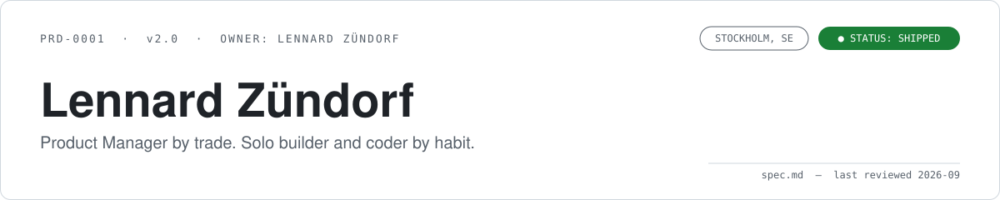
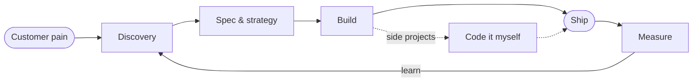

<picture>
  <source media="(prefers-color-scheme: dark)" srcset="img/banner-dark.svg">
  
</picture>

> [!NOTE]
> **This profile is written as a product spec**, because that is what I would do with any other product.
> Reviewers welcome. Leave comments on [LinkedIn](https://www.zuendorf.me/linkd), or ping me via [zuendorf.me](https://www.zuendorf.me).

## 1. Problem statement

Customer pain and business needs rarely arrive as tidy tickets. They show up as a support thread, a churned account, a spreadsheet someone maintains by hand, or a *"can we just…"* in a meeting.

Somebody has to turn that into a product decision, a spec an engineer can build against, and a system that keeps working after launch.

## 2. Proposed solution

A Product Manager who also builds.

- **Product Manager by trade.** Discovery, strategy, specs, prioritisation, shipping. Currently at [DIB Travel](https://dibtravel.com/product-new/) in Stockholm, Sweden 🇸🇪
- **Solo builder and coder by habit.** Side projects in TypeScript and Python, with and without AI.
- **Systems thinker by default.** I like making chaos manageable, ideally with a diagram.

Result: real products, strategy, and systems that *work*.

## 3. User stories

| As a…            | I want…                                                         | So that…                                        | Status      |
| ---------------- | --------------------------------------------------------------- | ----------------------------------------------- | ----------- |
| customer         | someone to understand my problem before building                | the feature solves it instead of adding to it   | ✅ shipped  |
| engineer         | a clear, scoped spec that doesn't change on Friday afternoon    | I can build with confidence                     | ✅ shipped  |
| founder / leader | strategy tied to numbers and a roadmap that survives contact    | we bet on the right things                      | ✅ shipped  |
| Lennard          | to keep writing code on the side                                | my technical judgement stays sharp              | 🔁 ongoing  |

## 4. How it works

## 5. Technical specification

**Side projects are built in and with:**

      

<strong>🧰 Full stack, tools, and everything else I have shipped with</strong>

 

**Core stack**

**Everyday tools**

**Frameworks and more**

## 6. Shipped

Side projects orbit three themes: **developer tooling, AI, and personal productivity.**

| Project | What it does | Built with |
| --- | --- | --- |
| [**indexed**](https://github.com/LennardZuendorf/indexed) | Lets coding agents search code, issue trackers, and docs through a local CLI and MCP server | Python |
| [**pytest-bench-action**](https://github.com/LennardZuendorf/pytest-bench-action) | GitHub Action that runs, records, and compares pytest benchmarks across branches and PRs | Python |
| [**vibe**](https://github.com/LennardZuendorf/vibe) | A spec-first meta-framework for agentic software development | JavaScript, Bash |

More in the [repositories tab](https://github.com/LennardZuendorf?tab=repositories).

## 7. Non-goals

- **Being a 10x engineer.** I am a PM who codes, not the other way round.
- **Shipping features nobody asked for.** Discovery comes first, always.
- **Perfect Swedish by Q4.** See roadmap.

## 8. Success metrics

| Metric                            | Target        | Current                                   |
| --------------------------------- | ------------- | ----------------------------------------- |
| Products that actually work       | 100 %         | 🟢 on track                                |
| Human languages                   | 4             | 3.5 · English C1, German native, Norwegian A2, Swedish loading… |
| Programming languages in daily use| 2             | ✅ TypeScript, Python                      |
| Diagrams per problem              | ≥ 1           | ✅ see section 4                           |

## 9. Roadmap and open questions

- [ ] Get Swedish past *fika*-level
- [ ] Ship the next side project before starting the one after it
- [ ] Keep exploring payments and fintech, developer tools, and systems thinking
- [x] Write a README that is not a wall of badges

## Appendix

<strong>A. Background</strong>

 

- **B.Sc. in Business Computing**, HTW Berlin, with an exchange semester at the University of Oslo
- **Languages:** English (C1), German (native), Norwegian (A2), learning Swedish
- **Interests:** Product strategy, payments and fintech, developer tools, systems thinking, coding, and making chaos manageable

<strong>B. Changelog</strong>

 

| Version | Date    | Change                                             |
| ------- | ------- | -------------------------------------------------- |
| 2.0     | 2026-09 | Rewritten as a product spec                        |
| 1.x     | 2023–26 | The badge era: stack, roles, and quick facts       |
| 1.0     | 2023-02 | Initial release                                    |

 

> [!TIP]
> Found a bug in this spec? That is what the comment section on LinkedIn is for.
